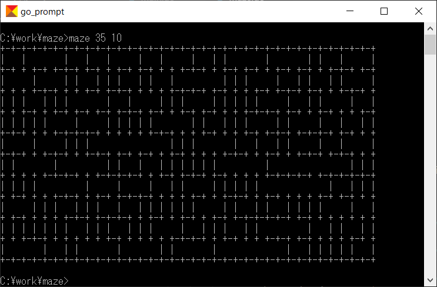
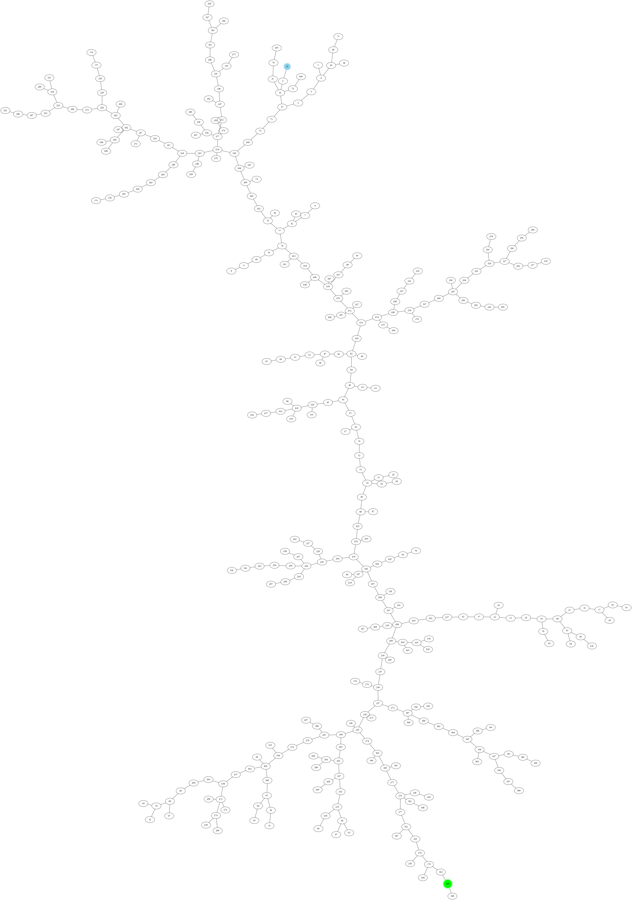

# maze (golang implementation)

----

# 迷路の作り方

本方式の特徴：迷路内の任意のマス目からすべてのマス目に一意に到達する経路が必ず存在する。
* スタートからゴールに必ず到達する。
* ループとなる経路がない。

## ①横M ×縦N のマス目を作る。

```
┌─┬─┬─┐
│ │ │ │
├─┼─┼─┤
│ │ │ │
├─┼─┼─┤
│ │ │ │
└─┴─┴─┘
```

## ②各マス目に 0～M*N-1 の番号をふる。

この番号は領域を特定する番号。
同じ番号ならば同じ領域、異なる番号ならば異なる領域に
あることを示す。
下の例では初期状態で9個の異なる領域がそれぞれのマス目に
割り当てられている状態。

```
┌─┬─┬─┐
│0│1│2│
├─┼─┼─┤
│3│4│5│
├─┼─┼─┤
│6│7│8│
└─┴─┴─┘
```

## ③マス目をさえぎる壁をランダムに選択し消去する。

このとき同じ領域を遮る壁を選ばないようにする。
```
┌─┬─┬─┐
│0│1│2│
├─┼ ┼─┤
│3│4│5│
├─┼─┼─┤
│6│7│8│
└─┴─┴─┘
```

## ④壁がなくなることで二つのマス目が同じ領域になるので、番号もそろえる。ここでは小さい番号にそろえる。

この例では領域4のマス目を領域1に変更する。
```
┌─┬─┬─┐
│0│1│2│
├─┼ ┼─┤
│3│1│5│
├─┼─┼─┤
│6│7│8│
└─┴─┴─┘
```

以下、すべてのマス目の領域が同じになる（つまり 0になる）
まで③④を繰り返す。
```
┌─┬─┬─┐
│0│1│2│
├─┼ ┼─┤
│1 1│5│
├─┼─┼─┤
│6│7│8│
└─┴─┴─┘
   ↓
┌─┬─┬─┐
│0│1│2│
├─┼ ┼─┤
│1 1│5│
├─┼─┼ ┤
│6│7│5│
└─┴─┴─┘
   ↓
┌─┬─┬─┐
│0│0│2│
├ ┼ ┼─┤
│0 0│5│
├─┼─┼ ┤
│6│7│5│
└─┴─┴─┘
   ↓
┌─┬─┬─┐
│0│0 0│
├ ┼ ┼─┤
│0 0│5│
├─┼─┼ ┤
│6│7│5│
└─┴─┴─┘
   ↓
┌─┬─┬─┐
│0│0 0│
├ ┼ ┼─┤
│0 0│5│
├─┼ ┼ ┤
│6│0│5│
└─┴─┴─┘
   ↓
┌─┬─┬─┐
│0│0 0│
├ ┼ ┼─┤
│0 0│5│
├─┼ ┼ ┤
│0 0│5│
└─┴─┴─┘
   ↓
┌─┬─┬─┐
│0│0 0│
├ ┼ ┼ ┤
│0 0│0│
├─┼ ┼ ┤
│0 0│0│
└─┴─┴─┘
```

すべてのマス目の領域が同じに
なったので繰り返し完了


## ★以下、実装のメモ。

### (1)マス目の識別番号

各マス目には領域を示す番号のほか、
そのマス目を識別する番号を左上から
右下に向けてZ字のようにナンバリングする。
マス目の識別：0～M*N-1

### (2)壁の識別番号

* 壁の総数：(M-1) * N + M * (N-1) = 2 * M * N - (M+N)

壁を識別する番号を次のように左上から右下に向けてナンバリングする。

* 縦の壁：0～(M-1) * N-1
* 横の壁：(M-1) * N～2 * M * N - (M+N) - 1

M=3,N=3 の例。数字（16進数）は太線の壁の識別番号を示す。
```
┌─┬─┬─┐┌─┬─┬─┐
│ ┃0┃1││ │ │ │
├─┼─┼─┤├━┼━┼━┤
│ ┃2┃3││6│7│8│
├─┼─┼─┤├━┼━┼━┤
│ ┃4┃5││9│A│B│
└─┴─┴─┘└─┴─┴─┘
```

### (3)壁が遮る二つのマス目の識別番号の特定

* 壁の識別番号＝wid とする。

縦の壁（0<=wid<(M-1)*N）のとき：

* 左のマス目：wid % (M-1) + (wid/(M-1)) * M
* 右のマス目：左のマス目 + 1

横の壁（(M-1) * N <= wid < 2 * M * N - (M+N)）のとき：

* 上のマス目：wid - (M-1) * N
* 下のマス目：上のマス目 + M

### (4)マス目の識別番号から壁の識別番号の特定

* マス目の識別番号＝cid とする。

マス目の右にある縦の壁：

* cid % M < M-1 のとき

 縦の壁：cid % M + (cid/M) * (M-1)

* cid % M >= M - 1

 縦の壁：なし

マス目の下にある横の壁：

* cid / M < N - 1 のとき
 横の壁：cid * M

* cid / M >= N - 1
 横の壁：なし

### (5)ループの終了条件

すべてのマス目の領域番号が0かどうかをチェックする。

例：
```
var areas []int // cid->aid

func check() bool {
  for cid:=0; cid<M*N-1; cid++ {
    if areas[cid] != 0 {
      return false
    }
  }
  return true
}
```

----

# 使い方

引数で width と height を指定すると、標準出力に迷路が表示される。

```
C:\work> maze 35 10
```



また、迷路内の移動可能な経路は同じフォルダ内の maze.dot に保存される。
Graphviz で画像ファイルに変換して確認することができる。

```
C:\work> dot -Kneato -Tpng -omaze.png maze.dot
```



仮に迷路の左上のセルをスタート（青）、右下のセルをゴール（緑）として、スタートからゴールへの一意な経路が存在することを視覚的に確認できる。
